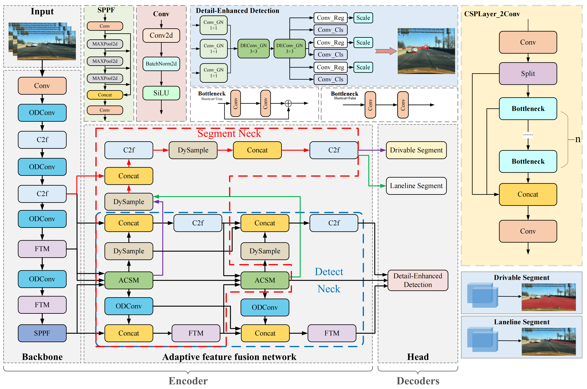
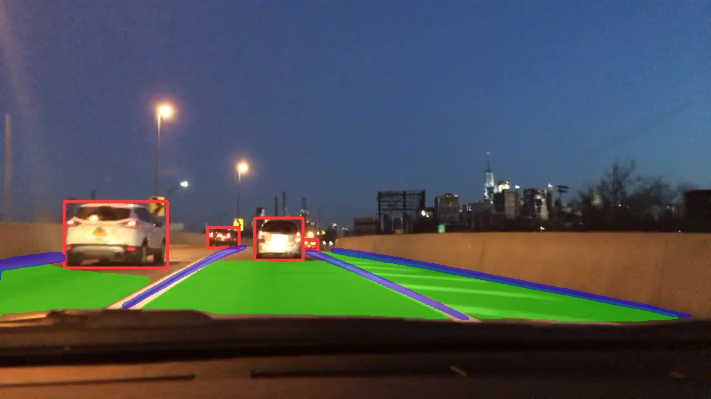
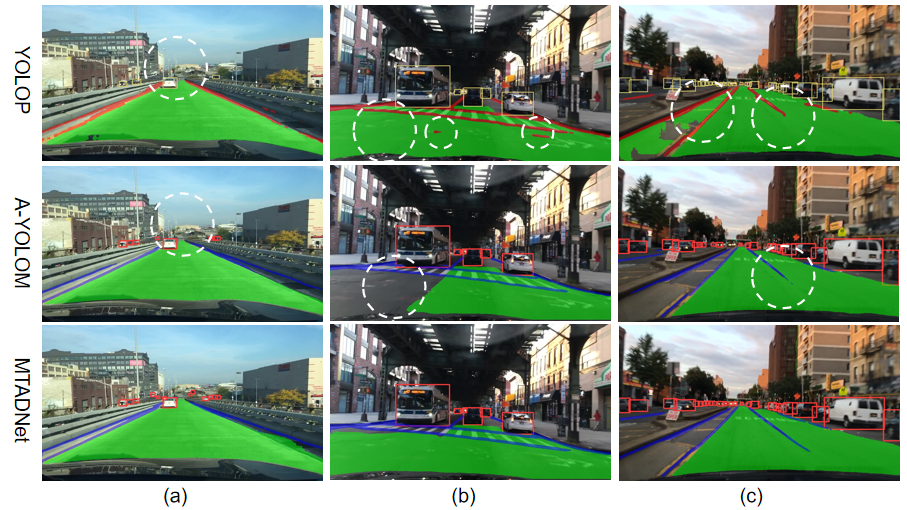
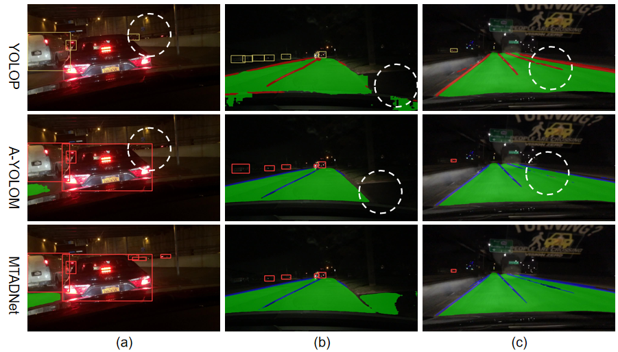

<div align="left">   


## MTFENet: A Multi-Task Autonomous Driving Network for Real-Time Target Perception
This repository(MTFENet) is the official PyTorch implementation of the paper "MTFENet: A Multi-Task Autonomous Driving Network for Real-Time Target Perception".  

---
### Update:
`2025-7-4`: We've uploaded the experiment results along with some code, and the full code will be released soon

### The Illustration of MTFENet




### Results

#### Evaluation of Model Size and Inference Speed.
| Networks       | Size (Pixel)| Parameters (M) | FPS(bs=32)  |
|----------------|-------------|----------------|-------------|
| YOLOP          | 640         | 7.90           | 361.27      |
| YOLOPv2        | 640         | 38.90          | 419.57      |
| YOLOPv3        | 640         | 30.2           | 389.58      |
| HybridNets     | 640         | 12.83          | 243.30      |
| A-YOLOM        | 640         | 13.61          | 346.53      |
| TriLiteNet     | 640         | **2.35**       | 423.50      |
| MTFENet        | 640         | 8.70           | **441.53**  |


|              |Traffic object detection     |Drivable area segmentation   |Laneline Segment|
|              |achievement                  |achievement                  |achievement     |
|--------------|-----------------------------|-----------------------------|----------------|
| Networks     |	mAP50 (%)   |	Recall (%)   |	mIoU (%)    |	Acc (%)      | IoU (%)        |
|--------------|--------------|--------------|--------------|--------------|----------------|
| Faster R-CNN | 81.20	      | 64.90	       | -            | -            | -              |
| YOLOV5s      |	77.20       |	86.80        | -            |	-            | -              |
| MultiNet     |	81.30       |	60.20        | 71.60        |	-	           | -              |
| DLT-Net      |	**89.40**   |	68.40        | 72.10        |	-            | -              |
| PSPNet       |	-           |	-            | 89.60        |	-            | -              |
| ENet         |	-           |	-            | -            |	34.12        | 14.64          |
| SCNN         |	-           |	-            | -            |	35.79        | 15.84          |
| ENet-SAD     |	-           | -            | -            |	36.56        | 16.02          |
| YOLOP        | 76.50        |	88.20        | 90.50        |	84.40        | 26.50          |
| HybridNets   | 77.30        |	89.70        | 91.50        |	85.40        | 31.60          |
| YOLOPv2      | 83.40        |	91.10        | 93.20        |	87.31        | 27.25          |
| A-YOLOM      | 81.10        |	86.90        | 91.00        |	84.90        | 28.80          |
| YOLOPv3      | 84.30        |	**96.90**    | 93.20        |	**88.30**    | 28.00          |
| TriLiteNet   | 72.30        |	85.60        | 92.40        |	82.30        | 29.80          |
| MTFENet      | 81.50        |	88.40        | **93.80**    |	87.60        | **33.70**      |

---
### Visualization

#### video visualization Results
* Note: The raw video comes from [HybridNets](https://github.com/datvuthanh/HybridNets/tree/main/demo/video/)
* The results of our experiments are as follows:
<td></td>

---

#### Real Road



#### Visual Comparison of Results on a Sunny Day


#### Visual Comparison of Results at Night


#### Visual Comparison of Results on a Rainy Day


#### Visual Comparison of Results on a Snow Day


### Requirement
We implemented the algorithm in a Linux environment and conducted all experiments on an NVIDIA RTX 4090 GPU equipped with 24GB of memory.
The development environment was based on Python==3.8.19(https://www.python.org/) ,PyTorch 1.13.1(https://pytorch.org/get-started/locally/), conda 24.1.2, and CUDA11.7, with pre-training conducted on the BDD100K dataset. 

```setup
cd MTFENet
pip install -e .
```
### Dataset
- Download the images from [images](https://bdd-data.berkeley.edu/). 
- Download the annotations of detection from [detection-object](https://uwin365-my.sharepoint.com/:u:/g/personal/wang621_uwindsor_ca/EflGScMT-D1MqBTTYUSMdaEBT1wWm5uB8BausmS7fDLsQQ?e=cb7age). 
- Download the annotations of drivable area segmentation from [seg-drivable-10](https://uwin365-my.sharepoint.com/:u:/g/personal/wang621_uwindsor_ca/EWyIyXDFCzRLhERniUiuyIABq257WF4DbNJBDB8Dmok91w?e=hgWtoZ). 
- Download the annotations of lane line segmentation from [seg-lane-11](https://uwin365-my.sharepoint.com/:u:/g/personal/wang621_uwindsor_ca/EUBQBO2KGFtHsexik3WvLZMBuaW1CsnHDTZo5eJ3ESdJNA?e=K6Tsem). 

We recommend the dataset directory structure to be the following:

```
# The id represent the correspondence relation
├─dataset root
│ ├─images
│ │ ├─train2017
│ │ ├─val2017
│ ├─detection-object
│ │ ├─labels
│ │ │ ├─train2017
│ │ │ ├─val2017
│ ├─seg-drivable-10
│ │ ├─labels
│ │ │ ├─train2017
│ │ │ ├─val2017
│ ├─seg-lane-11
│ │ ├─labels
│ │ │ ├─train2017
│ │ │ ├─val2017
```

Update the your dataset path in the `./test_yaml/bdd-mtfenet-multi.yaml`.

### Training

```
python ./ultralytics/train.py
```
### Evaluation

```
python ./ultralytics/val.py
```
### Prediction

```
python ./ultralytics/predict.py
```

  
**Notes**: 
We would like to express our sincere appreciation to the authors of the following works for their valuable contributions to the field of multi-task visual perception. Their research has provided strong foundations and meaningful benchmarks that have significantly guided and inspired our study. We also gratefully acknowledge the open-source code repositories they provided, which facilitated fair comparison and reproducibility in our experiments:

* **MultiNet** – [Paper](https://arxiv.org/pdf/1612.07695.pdf), [Code](https://github.com/MarvinTeichmann/MultiNet)
* **DLT-Net** – [Paper](https://ieeexplore.ieee.org/abstract/document/8937825)
* **Faster R-CNN** – [Paper](https://proceedings.neurips.cc/paper/2015/file/14bfa6bb14875e45bba028a21ed38046-Paper.pdf), [Code](https://github.com/ShaoqingRen/faster_rcnn)
* **YOLOv5s** – [Code](https://github.com/ultralytics/yolov5)
* **PSPNet** – [Paper](https://openaccess.thecvf.com/content_cvpr_2017/papers/Zhao_Pyramid_Scene_Parsing_CVPR_2017_paper.pdf), [Code](https://github.com/hszhao/PSPNet)
* **ENet** – [Paper](https://arxiv.org/pdf/1606.02147.pdf), [Code](https://github.com/osmr/imgclsmob)
* **SCNN** – [Paper](https://www.aaai.org/ocs/index.php/AAAI/AAAI18/paper/download/16802/16322), [Code](https://github.com/XingangPan/SCNN)
* **ENet-SAD** – [Paper](https://openaccess.thecvf.com/content_ICCV_2019/papers/Hou_Learning_Lightweight_Lane_Detection_CNNs_by_Self_Attention_Distillation_ICCV_2019_paper.pdf), [Code](https://github.com/cardwing/Codes-for-Lane-Detection)
* **YOLOP** – [Paper](https://link.springer.com/article/10.1007/s11633-022-1339-y), [Code](https://github.com/hustvl/YOLOP)
* **HybridNets** – [Paper](https://arxiv.org/abs/2203.09035), [Code](https://github.com/datvuthanh/HybridNets)
* **YOLOv8** – [Code](https://github.com/ultralytics/ultralytics)
* **A-YOLOM** – [Paper](https://arxiv.org/pdf/2310.01641.pdf), [Code](https://github.com/JiayuanWang-JW/YOLOv8-multi-task)
* **YOLOPv3** – [Paper](https://www.mdpi.com/2072-4292/16/10/1774), [Code](https://github.com/jiaoZ7688/YOLOPv3)
* **TriLiteNet** – [Paper](https://ieeexplore.ieee.org/document/10930421), [Code](https://github.com/chequanghuy/TriLiteNet)

